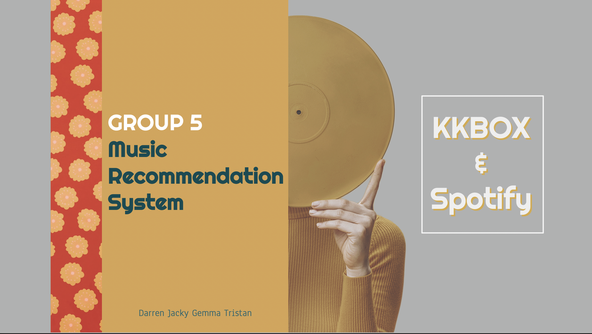
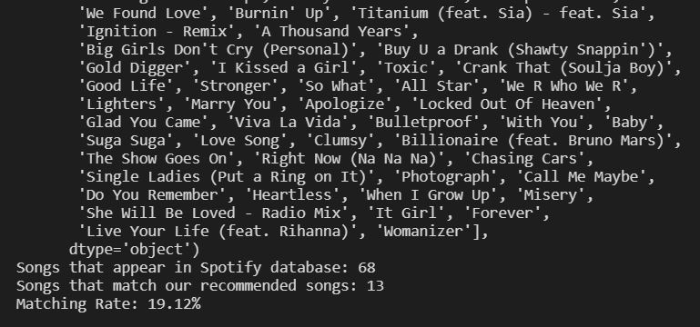
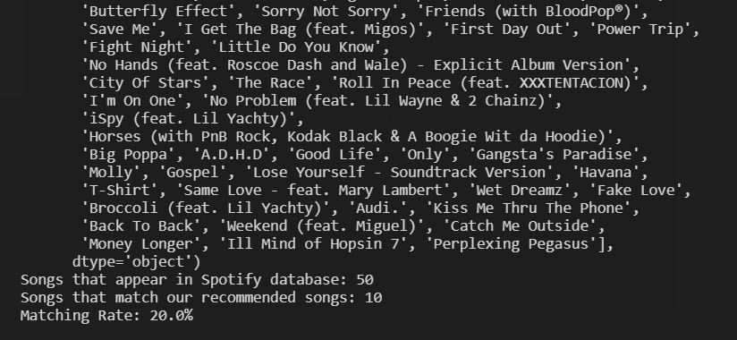

# FTDS_Project3_MusicRecommendation
Music Recommendation Using Datasets of Spotify and KKBox

## Music Recommendation System by Collabarative Filtering
The thrive of reommendation system is observed in various business products across different industries. No matter it is online shopping, crowdfunding sites or subscription-based entertainments such as Netflix and Steam, an accurate recommendation system paves the way to vibrant user engagement and subsequently drive revenues effectively. In this project, we are constructing a music recommendation system based on the both Spotify and KKbox data. Spotify has been rolling out the "Discover Weekly" features for years which provide recommendation to users in a weekly basis. The aim of the project is to shred some light on such feature based on our own recommendation system and evaluate its accuracy.

## Data Collection

#### - Spotify
<a href="https://www.aicrowd.com/challenges/spotify-million-playlist-dataset-challenge/dataset_files">Spotify Million Dataset</a> [1] is provided in the Spotify Million Playlist Dataset Challenge. The dataset contains 1,000,000 playlists, including playlist titles and song titles within the playlist, created by users on Spotify between January 2010 and October 2017.

#### - KKBox
<a href="https://www.kaggle.com/c/kkbox-music-recommendation-challenge">KKbox Dataset</a> [2] is a music recommendation challenge held by WSDM in which the dataset is donated by KKbox, which holds the world’s most comprehensive Asia-Pop music library with over 30 million tracks. The dataset itself contains around 234,000 detailed information of songs including genre, artists names, song length etc.

## Data Preprocessing

#### - Spotify
- The Spotify dataset consists of 1,000 slice files, each slice file containing 1,000 playlists
- We will use the first 10 slice files to construct our recommendation system, it could be scaled up with higher computational power
- The slice files are converted from json format to python dataframe, containing all the playlists and corresponding songs

#### - KKBox
- The KKbox dataset consists of 234k songs information including whether the user has listened to the song once or more than once
- The dataset lacks of information on the users' end information including playlists of users which could be a limitation for music recommendation since songs listened by the user are not categorized and in most cases users listen to various genres in which making music recommendation of the dataset would be less custom-made
- We have used both of the recommendation systems for the dataset which are collaborative RS and content-based RS to explore and seek better results through comparison

## Recommendation System Structure
- User inputs its favourite playlist into the recommendation system
- Creat a dataframe storing playlist number and "Hamming Distance", with its value initiated as 1
- For each playlist, hamming distance between the spotify playlist database and user's input playlist is calculated and stored in the above dataframe
- The lower the hamming distance, the nearer neighbour between the user playlist and the target playlist
- The top K's neighbourhood playlist (50 in our test case) is returned
- Among the top K's playlists, unique value count on songs is performed
- Top N songs (100 in our test case) are then recommended to the user

## Results
- A evaluation method is designed to access the accuracy of the recommendation system
- The metrics-to-go is "Matching rate", which is the percentage of recommended songs which the user will put into their own playlist
- User will input a playlist of themselves containing 100 songs
- First 20 songs are used for generating recommended songs, the remaining 80 songs are used for evaluation
- 100 songs will be recommended to the user as output, and then these 100 songs will be compared with the aforementioned 80 songs
- Matching rate = Matched number of songs / total songs compared
- For both of our test cases, the matching rate is around 20%, that means user will like the recommended songs 1 in 5 time

<table>
  <tr>
    <th>Test Case 1</th>
    <th>Test Case 2</th>
  </tr>
  <tr>
    <th></th>
    <th></th>
  </tr>
  
</table>

## References
1. *Ching-Wei Chen, Paul Lamere, Markus Schedl, and Hamed Zamani. Recsys Challenge 2018: Automatic Music Playlist Continuation. In Proceedings of the 12th ACM Conference on Recommender Systems (RecSys ’18), 2018.*

### Team Members
KKbox RS:
Darren Cheng
Gemma Lai

Spotify RS:
Jacky Chan
Tristan Young
